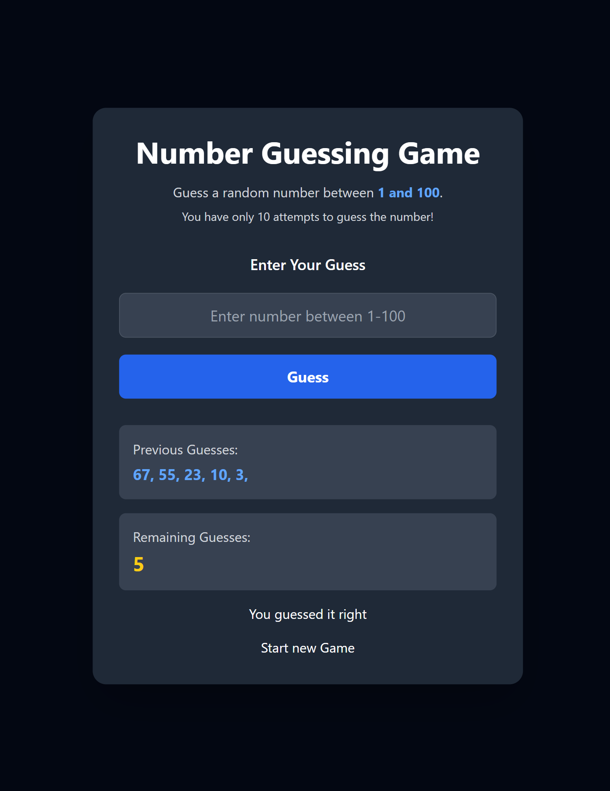

# Guess a Number 🎯

A simple and interactive **Guess a Number game** built using **HTML, JavaScript, and Tailwind CSS**.

The computer generates a random number between **1 and 100**, and the player has **10 attempts** to guess it correctly.



## 🚀 Features

* Generates a random number between 1 and 100
* Allows the user to enter guesses
* Shows previous guesses
* Displays the number of remaining attempts
* Gives hints when the guess is too high or too low
* Shows a success message when the correct number is guessed
* Ends the game after the maximum number of attempts
* Allows the user to start a new game
* Input validation for invalid numbers
* Responsive and clean user interface

## 🛠️ Technologies Used

* **HTML5** – Structure of the game
* **JavaScript** – Game logic and functionality
* **Tailwind CSS** – Styling and responsive design

## 🎮 How to Play

1. The computer generates a random number between **1 and 100**.
2. Enter your guess in the input field.
3. Click the **Guess** button.
4. The game will tell you whether your number is:

   * Too Low 🔽
   * Too High 🔼
   * Correct 🎉
5. You have **10 attempts** to guess the correct number.
6. If you run out of attempts, the game ends and the random number is revealed.
7. Click **Start New Game** to play again.

## 🧠 Game Logic

A random number is generated using:

```javascript
randomNumber = parseInt(Math.random() * 100 + 1);
```

The user's input is converted into a number:

```javascript
const guess = parseInt(userInput.value);
```

The game then compares the user's guess with the randomly generated number.

### If the guess is too low:

```javascript
if (guess < randomNumber) {
    displayMessage(`Number is TOO low`);
}
```

### If the guess is too high:

```javascript
else if (guess > randomNumber) {
    displayMessage(`Number is TOO High`);
}
```

### If the guess is correct:

```javascript
if (guess === randomNumber) {
    displayMessage(`You guessed it right`);
    endGame();
}
```

## 🔮 Future Improvements

* Add difficulty levels
* Add a timer
* Add score calculation
* Add sound effects
* Add animations
* Store high scores
* Add a restart button
* Add different number ranges

## 👩‍💻 Author

**Janvi Chauhan**

---

⭐ If you like this project, consider giving the repository a star!
